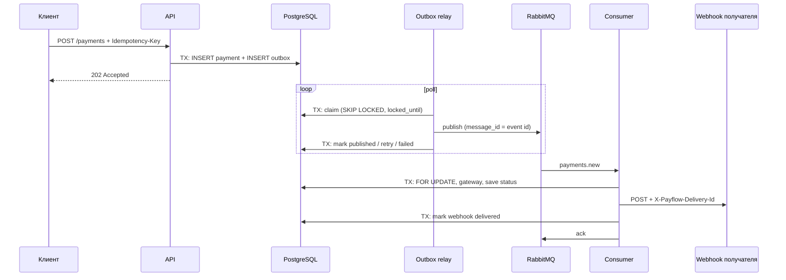

# Payflow

Сервис асинхронного проведения платежей. API регистрирует платёж и отвечает `202`; отдельные процессы публикуют
команду через transactional outbox, обрабатывают её в RabbitMQ consumer и отправляют итоговый webhook.

## Запуск

```bash
cp .env.example .env
docker compose up --build
```

| Компонент           | Адрес                                        |
|---------------------|----------------------------------------------|
| API                 | `http://127.0.0.1:8000`                      |
| Healthcheck         | `http://127.0.0.1:8000/health`               |
| RabbitMQ Management | `http://127.0.0.1:15672` (`guest` / `guest`) |

Compose поднимает `postgres`, `rabbitmq`, одноразовый `migrator`, затем `api`, `outbox` и `consumer`.

### Без полного Compose

```bash
uv sync --locked
docker compose up -d postgres rabbitmq
uv run alembic upgrade head
```

В отдельных терминалах:

```bash
uv run python -m payflow.presentation.api
uv run python -m payflow.presentation.outbox
uv run python -m payflow.presentation.consumer
```

Вне Docker в `DATABASE_URL` и `RABBITMQ_URL` укажите `localhost` вместо hostnames Compose.

### Конфигурация

Все переменные и значения по умолчанию — в `.env.example` (разбор в `payflow/infra/config.py`). Главные: `API_KEY`,
`DATABASE_URL`, `RABBITMQ_URL`. `OUTBOX_LEASE_SECONDS` должен превышать время публикации батча
(`OUTBOX_BATCH_SIZE × OUTBOX_PUBLISH_TIMEOUT_SECONDS`), иначе растёт число дублей.

### Проверки

Нужны [just](https://github.com/casey/just) и Postgres (`TEST_DATABASE_URL`, по умолчанию localhost):

```bash
just db      # Postgres для тестов
just check   # ruff format --check, ruff check, mypy (strict), pytest
just fix     # автоформатирование и безопасные правки линтера
```

## HTTP API

Все запросы требуют `X-API-Key`. Схемы — в `/docs` и `payflow/presentation/api/schemas.py`.

```bash
curl -X POST http://127.0.0.1:8000/api/v1/payments \
  -H "X-API-Key: secret-api-key" -H "Idempotency-Key: invoice-741-attempt-1" \
  -H "Content-Type: application/json" \
  -d '{"amount": "1490.00", "currency": "RUB", "description": "Invoice 741",
       "metadata": {"invoice_id": "741"}, "webhook_url": "https://merchant.example/payment-events"}'
# 202 {"payment_id": "...", "status": "pending", "created_at": "..."}

curl http://127.0.0.1:8000/api/v1/payments/<payment_id> -H "X-API-Key: secret-api-key"
```

Повтор с тем же `Idempotency-Key` и тем же телом возвращает исходный платёж; другое тело — `409`. Ответы `GET`:
`200`, `202` (ещё обрабатывается), `401`, `404`, `422`.

## Архитектура

```text
presentation ──> application <── infra
                     │             │
                     └─> domain <──┘
```

- `domain` — сущности и enum, без внешних зависимостей;
- `application` — сценарии (`services/`) и `Protocol`-интерфейсы (`interfaces/`);
- `infra` — SQLAlchemy (`database/`), FastStream/RabbitMQ (`messaging/`), webhook и gateway (`integrations/`);
- `bootstrap` — `Resources` и фабрики `make_*`: единственное место, где сервисы соединяются с реализациями;
- `presentation` — процессы `api`, `consumer`, `outbox`.

Сервисы получают зависимости через конструктор; фреймворки подключают их тонкими `Depends`-провайдерами, в тестах они
подменяются (`dependency_overrides`, `dependency_provider.override`). Границы слоёв проверяет
`tests/unit/test_package_boundaries.py`. Три процесса масштабируются независимо и общаются только через PostgreSQL и
RabbitMQ.

## Прохождение платежа



Gateway — эмулятор: задержка 2–5 с, 90% успехов.

## Проектные решения по надёжности

Подходы из *Designing Data-Intensive Applications* (Клеппман).

| Проблема                                        | Решение                                                                                                                                                       |
|-------------------------------------------------|---------------------------------------------------------------------------------------------------------------------------------------------------------------|
| Нельзя атомарно записать в БД и брокер          | Transactional outbox: платёж и событие пишутся одной транзакцией, relay публикует их отдельно. Проще 2PC и CDC, но задержка определяется polling              |
| Повторы доставки неизбежны                      | At-least-once на каждом звене, дубли гасятся идемпотентной обработкой                                                                                         |
| Транспорт не защищает от повторов выше по стеку | Сквозные идентификаторы: `Idempotency-Key` (уникальный индекс + `ON CONFLICT DO NOTHING`), `message_id` = `outbox.id`, `X-Payflow-Delivery-Id` = `payment_id` |
| Долгие блокировки на время сетевых вызовов      | Relay берёт строки с lease (`locked_until`), публикация и webhook идут вне транзакций. Просроченный lease даёт дубль, а не порчу данных                       |
| Параллельная обработка одного платежа           | `FOR UPDATE` по платежу; вызов шлюза остаётся под ним, потому что списание не идемпотентно                                                                    |
| Порядок сообщений                               | Не гарантируется: `payment.created` его не требует                                                                                                            |

Повторы идут с exponential backoff: relay хранит задержку в `next_attempt_at`, consumer — в TTL retry-очередей.
Исчерпанные попытки не теряются: `failed` в outbox, DLQ в RabbitMQ.

**Ограничения:** нет дедупликации по `message_id` в consumer; нет retention `published` и переобработки `failed` в
outbox; webhook может уйти дважды; порядок событий не гарантирован; все ошибки consumer уходят в retry без разбора.

## Механизмы

**Outbox.** (1) Короткая транзакция забирает строки (`pending`, `next_attempt_at` наступил, `locked_until` пуст или
истёк) через `FOR UPDATE SKIP LOCKED` и ставит `locked_until = now + lease`. (2) Публикация без транзакции, с таймаутом.
(3) Отдельная транзакция фиксирует `published` либо увеличивает `attempts` с backoff; после `OUTBOX_MAX_ATTEMPTS` —
`failed`. Падение между шагами 2 и 3 даёт повторную публикацию со стабильным `message_id`.

**RabbitMQ.** Exchange `payments` → очередь `payments.new`; при ошибке сообщение уходит в `payments.new.retry.N` с
задержкой `RETRY_BASE_DELAY_SECONDS * 2^(N-1)` и после TTL возвращается обратно; после `RETRY_MAX_ATTEMPTS` — reject в
`payments.dlx` → `payments.new.dlq`. Сообщения persistent, `ack` — вручную после обработки или постановки в retry.

**Webhook.** `POST` на `webhook_url` платежа с заголовком `X-Payflow-Delivery-Id` (= `payment_id`, стабилен между
повторами), без открытой транзакции. После `2xx` отметка пишется в `webhook_deliveries` и проверяется при повторной
обработке. Если consumer упал после отправки, но до отметки, вебхук уйдёт повторно — получатель должен хранить
обработанные `X-Payflow-Delivery-Id` и на повтор отвечать `2xx`, не повторяя бизнес-действие.
